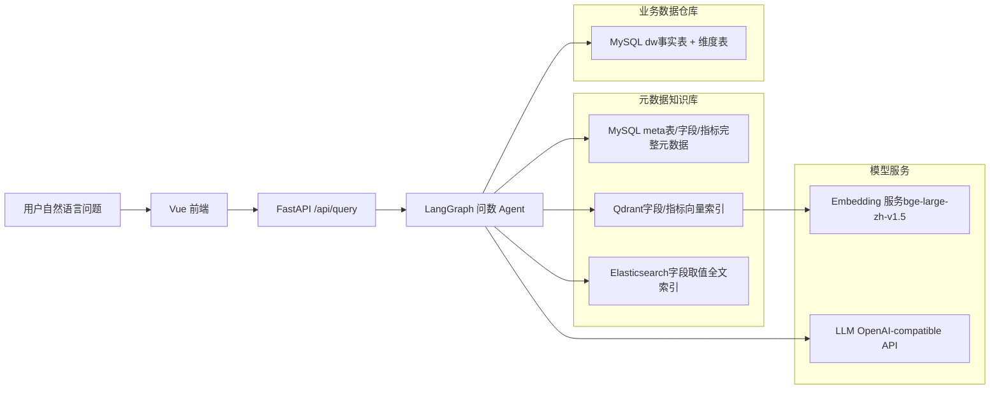
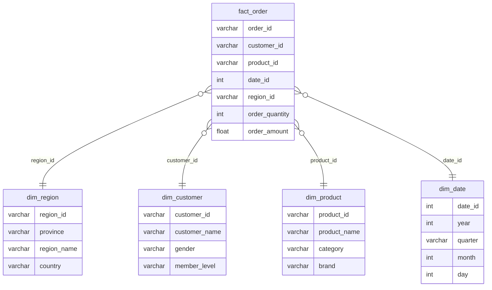
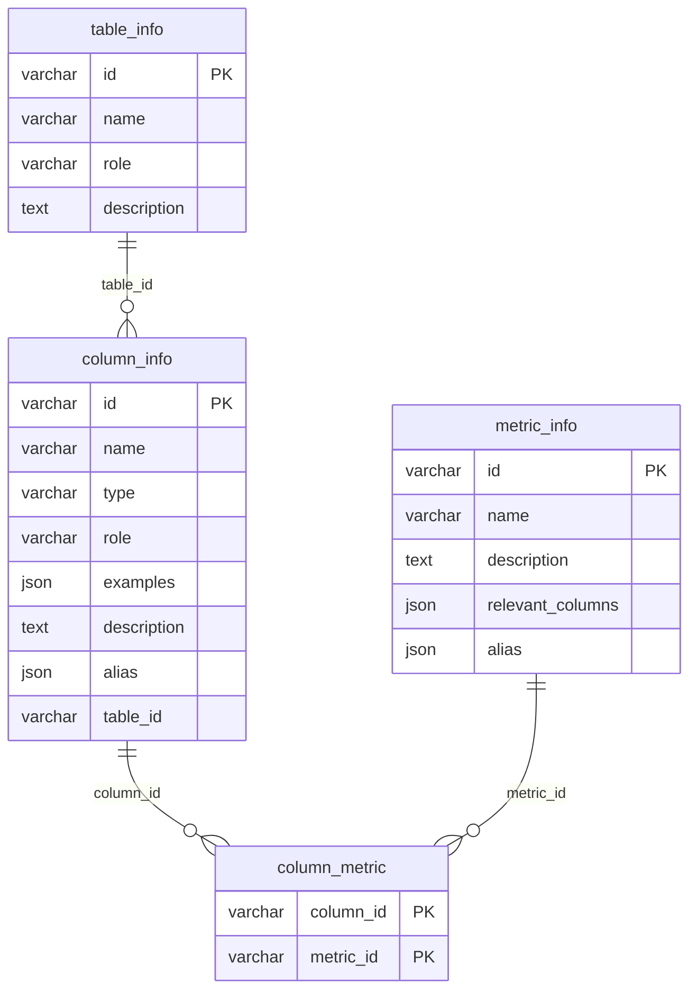
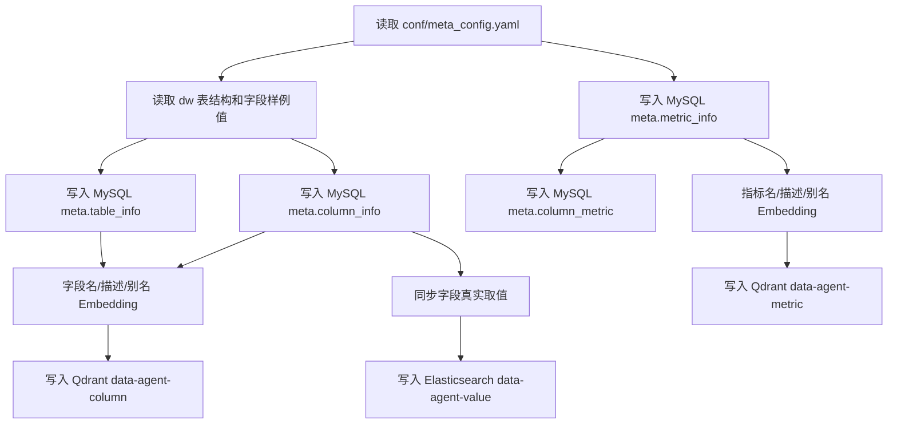
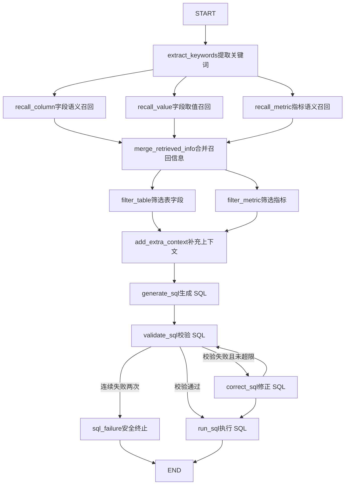

# Data Agent 智能问数系统

Data Agent 是一个面向数据仓库场景的 Text-to-SQL 智能问数系统。用户可以直接用自然语言提问，系统会自动完成问题理解、元数据召回、SQL 生成、SQL 校验、SQL 执行和结果返回。

项目核心目标是降低业务人员使用数据仓库的门槛，让用户不需要掌握复杂 SQL，也能通过对话方式查询数据。

## 项目特点

- 基于 LangGraph 编排多阶段 Agent 流程，流程可观测、可扩展、可纠错。
- 使用 MySQL 管理完整元数据，包括表信息、字段信息、指标定义和字段指标关系。
- 使用 Qdrant 构建字段和指标的语义向量索引，提升自然语言到 Schema 的匹配能力。
- 使用 Elasticsearch 构建字段取值全文索引，识别用户问题中的真实业务取值。
- 使用 Text Embeddings Inference 本地部署 `BAAI/bge-large-zh-v1.5` 作为 Embedding 服务。
- 使用 OpenAI-compatible LLM 接口完成关键词扩展、候选筛选、SQL 生成与 SQL 修正。
- 提供 FastAPI 后端接口和 Vue 前端页面，支持 SSE 流式返回 Agent 执行进度和查询结果。
- 使用 Docker Compose 编排 MySQL、Qdrant、Elasticsearch、Kibana、Embedding 等基础服务。

## 技术栈

后端：

- Python 3.12
- FastAPI
- LangGraph
- LangChain
- SQLAlchemy Async
- asyncmy
- Qdrant Client
- Elasticsearch Async Client
- jieba
- OmegaConf
- Loguru

前端：

- Vue 3
- Vite

基础服务：

- MySQL 8.0
- Qdrant v1.16
- Elasticsearch 8.19.10
- Kibana 8.19.10
- HuggingFace Text Embeddings Inference CPU

## 系统架构



## 数据库设计

项目中有两个 MySQL 数据库：

- `dw`：模拟业务数据仓库。
- `meta`：保存数据仓库的元数据知识。

### 业务数仓 dw

`dw` 使用典型星型模型：



### 元数据库 meta

`meta` 负责保存完整的语义元数据：



## 三类知识库的分工

### MySQL meta

MySQL 保存完整、结构化、可追溯的元数据，例如：

- 表名、表类型、表描述
- 字段名、字段类型、字段角色、字段描述、字段别名、样例值
- 指标名、指标描述、指标别名、指标依赖字段

它是系统的“事实来源”。

### Qdrant

Qdrant 用于语义召回字段和指标。

字段索引内容包括：

- 字段名
- 字段描述
- 字段别名

指标索引内容包括：

- 指标名
- 指标描述
- 指标别名

它解决的问题是：用户说法和数据库字段名不一致时，仍然可以召回相关元数据。

例如：

```text
用户说：销售额、成交额、收入
可能召回：fact_order.order_amount 或 GMV
```

### Elasticsearch

Elasticsearch 用于召回字段真实取值。

它解决的问题是：用户问题中出现的实体值应该映射到哪个字段。

例如：

```text
用户说：华北地区
ES 命中：
value = 华北
column_id = dim_region.region_name
```

这样生成 SQL 时就可以得到准确条件：

```sql
WHERE dim_region.region_name = '华北'
```

## 元数据配置

元数据知识库的输入来自 `conf/meta_config.yaml`。

该文件描述：

- 哪些表进入知识库
- 每张表是什么角色，事实表还是维度表
- 每个字段的业务描述、字段角色、别名
- 哪些字段需要同步取值到 Elasticsearch
- 指标定义、指标别名、指标依赖字段

示例结构：

```yaml
tables:
  - name: fact_order
    role: fact
    description: 订单事实表
    columns:
      - name: order_amount
        role: measure
        description: 订单金额
        alias: [销售额, 订单金额, 收入]
        sync: false

metrics:
  - name: GMV
    description: 所有订单的成交金额总和
    relevant_columns:
      - fact_order.order_amount
    alias: [成交总额, 订单总额]
```

`sync: true` 的字段会把真实字段取值写入 Elasticsearch，用于后续识别 WHERE 条件或分组维度。

## 元知识库构建流程

构建入口：

```text
app/scripts/build_meta_knowledge.py
```

执行流程：



构建命令：

```powershell
cd D:\code\data-agent
.\.venv\Scripts\python.exe -m app.scripts.build_meta_knowledge -c .\conf\meta_config.yaml
```

成功标志：

```text
元数据知识库构建完成
```

如果重复构建遇到主键冲突，需要先清空 meta 库相关表：

```powershell
docker exec -it mysql mysql -uatguigu -pAtguigu.123 meta
```

进入 MySQL 后执行：

```sql
TRUNCATE TABLE column_metric;
TRUNCATE TABLE metric_info;
TRUNCATE TABLE column_info;
TRUNCATE TABLE table_info;
exit;
```

## Agent 执行流程

Agent 使用 LangGraph 编排，定义在：

```text
app/agent/graph.py
```

完整流程：



### 节点说明

`extract_keywords`

- 使用 jieba 从用户问题中抽取关键词。
- 保留原始问题，保证完整语义不丢失。
- 输出 `keywords`。

`recall_column`

- 调用 LLM 扩展字段召回关键词。
- 对关键词做 Embedding。
- 查询 Qdrant 字段向量索引。
- 输出候选字段 `retrieved_column_infos`。

`recall_value`

- 调用 LLM 抽取可能的字段取值。
- 查询 Elasticsearch 字段取值索引。
- 输出候选取值 `retrieved_value_infos`。

`recall_metric`

- 调用 LLM 扩展指标召回关键词。
- 对关键词做 Embedding。
- 查询 Qdrant 指标向量索引。
- 输出候选指标 `retrieved_metric_infos`。

`merge_retrieved_info`

- 合并字段、取值、指标三路召回结果。
- 根据指标依赖字段回查 meta，补齐必要字段。
- 根据字段取值回查 meta，补齐取值对应字段。
- 将命中的字段取值补入字段 examples。
- 为多表查询补充主键和外键字段，提升 JOIN 生成准确率。
- 生成 `table_infos` 和 `metric_infos`。

`filter_table`

- 使用 LLM 从候选表字段中筛选真正需要的表和字段。
- 减少召回噪声，避免 SQL 生成时使用无关字段。

`filter_metric`

- 使用 LLM 从候选指标中筛选当前问题真正需要的指标。

`add_extra_context`

- 补充当前日期、季度、星期等时间上下文。
- 补充数据库方言和版本信息。
- 为处理“本月”“最近三个月”等时间表达提供依据。

`generate_sql`

- 将用户问题、表字段信息、指标信息、日期信息、数据库信息输入 LLM。
- 输出 SQL 字符串。

`validate_sql`

- 先检查 SQL 只允许 `SELECT` 或 `WITH`，拦截写操作、多语句和 `FOR UPDATE`。
- 再使用数据库 `EXPLAIN` 做执行前校验。
- 校验成功则进入执行节点。
- 校验失败则记录错误信息，进入 SQL 修正节点。

`correct_sql`

- 根据原始问题、候选上下文、原 SQL 和数据库报错，让 LLM 修正 SQL。
- 修正后必须回到 `validate_sql`，最多自动纠错 2 次。

`run_sql`

- 执行最终 SQL，并再次执行只读安全检查。
- 通过 SSE 返回表格结果给前端。

## API 说明

后端接口：

```http
POST /api/query
Content-Type: application/json
```

请求体：

```json
{
  "query": "统计华北地区的销售总额"
}
```

返回类型：

```text
text/event-stream
```

返回内容包含两类事件。

进度事件：

```json
{
  "type": "progress",
  "step": "生成SQL语句",
  "status": "running"
}
```

结果事件：

```json
{
  "type": "result",
  "data": [
    {
      "sales_amount": 12345.0
    }
  ]
}
```

## 目录结构

```text
.
├── app
│   ├── agent                 # LangGraph Agent 流程、状态和节点
│   │   ├── graph.py
│   │   ├── state.py
│   │   └── nodes
│   ├── api                   # FastAPI 路由、依赖、请求模型
│   ├── clients               # MySQL、Qdrant、ES、Embedding 客户端管理
│   ├── conf                  # 配置模型
│   ├── core                  # 日志、生命周期、上下文
│   ├── entities              # 领域实体
│   ├── models                # SQLAlchemy ORM 模型
│   ├── prompt                # Prompt 加载器
│   ├── repositories          # 数据访问层
│   ├── scripts               # 元知识库构建脚本
│   └── services              # 业务服务
├── conf
│   ├── app_config.yaml       # 服务连接配置
│   └── meta_config.yaml      # 元数据语义配置
├── docker
│   ├── docker-compose.yml    # 基础服务编排
│   ├── mysql                 # 初始化 SQL
│   ├── elasticsearch         # ES + IK 插件构建
│   └── embedding             # 本地 Embedding 模型目录
├── data-agent-fronted        # Vue 前端
├── prompts                   # LLM Prompt 模板
├── main.py                   # FastAPI 入口
├── pyproject.toml
└── uv.lock
```

## 环境准备

### 1. Python 环境

项目要求：

```text
Python >= 3.12
```

推荐使用 uv 管理依赖：

```powershell
cd D:\code\data-agent
uv sync
```

如果当前机器没有 uv，也可以使用已有虚拟环境：

```powershell
.\.venv\Scripts\python.exe -m pip install -e .
```

### 2. Docker 服务

进入 docker 目录启动服务：

```powershell
cd D:\code\data-agent\docker
docker compose up -d --build
```

确认服务状态：

```powershell
docker ps
```

需要看到以下容器：

```text
mysql
elasticsearch
kibana
qdrant
embedding
```

服务端口：

| 服务 | 地址 |
| --- | --- |
| MySQL | localhost:3307 |
| Elasticsearch | http://localhost:9200 |
| Kibana | http://localhost:5601 |
| Qdrant HTTP | http://localhost:6333 |
| Qdrant gRPC | localhost:6334 |
| Embedding | http://localhost:8081 |

### 3. Embedding 模型

Embedding 容器挂载模型目录：

```text
docker/embedding/bge-large-zh-v1.5
```

需要确保该目录中存在模型文件，例如：

```text
config.json
pytorch_model.bin
tokenizer.json
vocab.txt
modules.json
```

可以测试 Embedding 服务：

```powershell
Invoke-WebRequest -Uri http://localhost:8081/embed `
  -Method POST `
  -ContentType 'application/json' `
  -Body '{"inputs":["测试"]}' `
  -UseBasicParsing
```

返回 `200` 且包含向量数组即正常。

### 4. LLM 配置

LLM 的模型名称和服务地址位于 `conf/app_config.yaml`，API Key 只从环境变量 `OPENAI_API_KEY` 读取，配置文件中不保存密钥。

PowerShell 当前窗口临时配置：

```powershell
$env:OPENAI_API_KEY = "你的新 API Key"
```

如果希望对当前 Windows 用户持久保存：

```powershell
[Environment]::SetEnvironmentVariable("OPENAI_API_KEY", "你的新 API Key", "User")
```

执行持久配置后，请重新打开 PowerShell 或 IDE，再启动后端。`.env.example` 仅作为变量名模板，项目不自动加载 `.env` 文件。

如果 Key 曾经出现在 Git、日志、截图或聊天记录中，应先在模型服务平台撤销旧 Key 并创建新 Key，然后只设置新 Key，不要把真实值写回配置文件。

## 测试

在不连接 Docker 服务的情况下运行 SQL 安全校验测试：

```powershell
.\.venv\Scripts\python.exe -m unittest discover -s tests -v
```
运行 Agent 端到端评测：

```powershell
.\.venv\Scripts\python.exe -m app.scripts.eval_agent -c .\eval_cases.yaml
```

评测用例定义在：

```text
eval_cases.yaml
```

评测报告默认输出到：

```text
eval_reports/
```

`eval_reports/` 已加入 `.gitignore`，避免把本地评测产物提交到仓库。

### 当前评测结果

最近一次 12 条核心问数用例评测结果：

| 指标 | 结果 |
| --- | --- |
| 用例数 | 12 |
| 成功率 | 100% |
| 非空结果率 | 100% |
| 表命中率 | 100% |
| 字段命中率 | 100% |
| 平均耗时 | 11.47s |
| 平均 SQL 修正次数 | 0 |

平均节点耗时：

| 节点 | 平均耗时 |
| --- | --- |
| generate_sql | 6.53s |
| recall_value | 3.94s |
| recall_column | 1.01s |
| recall_metric | 1.01s |
| extract_keywords | 61.76ms |
| filter_table | 0.43ms |
| filter_metric | 0.52ms |

### 性能优化记录

| 优化点 | 效果 |
| --- | --- |
| 字段召回和指标召回改为批量 Embedding | 减少多关键词逐次请求 Embedding 服务的开销 |
| Embedding 客户端增加内存缓存和并发请求去重 | 重复关键词不再重复计算向量 |
| 分组、排行、趋势类问题默认跳过字段取值召回 | 避免无条件聚合问题误触发 ES/LLM 取值识别 |
| 小候选集跳过 LLM 过滤 | `filter_table` 和 `filter_metric` 平均耗时降到毫秒级 |
| SQL 生成使用紧凑上下文 | 减少 Prompt 体积，降低 SQL 生成延迟 |
| TopN 商品排行增加确定性 SQL 模板 | 典型 TopN 问题从约 30s 降到约 1.35s |

整体平均耗时从早期约 22.65s 优化到约 11.47s，延迟降低约 49%。

## 启动流程

### 1. 启动基础服务

```powershell
cd D:\code\data-agent\docker
docker compose up -d --build
```

### 2. 构建元数据知识库

```powershell
cd D:\code\data-agent
.\.venv\Scripts\python.exe -m app.scripts.build_meta_knowledge -c .\conf\meta_config.yaml
```

看到下面日志表示成功：

```text
元数据知识库构建完成
```

### 3. 启动后端服务

```powershell
cd D:\code\data-agent
.\.venv\Scripts\python.exe -m fastapi dev main.py
```

也可以使用 uv：

```powershell
uv run fastapi dev main.py
```

默认访问：

```text
http://127.0.0.1:8000
```

接口文档：

```text
http://127.0.0.1:8000/docs
```

### 4. 启动前端

```powershell
cd D:\code\data-agent\data-agent-fronted
npm install
npm run dev
```

Vite 默认访问：

```text
http://localhost:5173
```

## 示例问题

可以尝试以下问题：

```text
统计华北地区的销售总额
查询手机数码品类的订单金额
统计 Q1 每个月的 GMV
统计不同会员等级的订单金额
查询华东地区的平均订单金额
```

以“统计华北地区的销售总额”为例，系统会经历：

```text
提取关键词 -> 字段召回 -> 取值召回 -> 指标召回 -> 合并上下文 -> 筛选表字段 -> 筛选指标 -> 生成 SQL -> 校验 SQL -> 执行 SQL -> 返回结果
```

可能生成类似 SQL：

```sql
SELECT SUM(f.order_amount) AS sales_amount
FROM fact_order f
JOIN dim_region r ON f.region_id = r.region_id
WHERE r.region_name = '华北';
```

## Kibana 调试

打开 Kibana：

```text
http://localhost:5601
```

查看 ES 索引：

```http
GET _cat/indices?v
```

字段取值索引：

```text
data-agent-value
```

测试取值检索：

```http
GET data-agent-value/_search
{
  "query": {
    "match": {
      "value": "统计华北地区的销售总额"
    }
  }
}
```

正常会命中类似：

```json
{
  "value": "华北",
  "column_id": "dim_region.region_name"
}
```

## 常见问题

### 1. `Duplicate entry ... for key PRIMARY`

说明元数据表里已经有上一次构建的数据。清空 meta 表后重新构建：

```sql
TRUNCATE TABLE column_metric;
TRUNCATE TABLE metric_info;
TRUNCATE TABLE column_info;
TRUNCATE TABLE table_info;
```

### 2. Qdrant 请求出现 502

本机代理可能影响 Python HTTP 客户端访问 localhost。项目中的 Qdrant/Embedding 客户端应关闭环境代理或确保 localhost 不走代理。

### 3. Embedding 容器反复重启

通常是模型目录不完整。检查：

```text
docker/embedding/bge-large-zh-v1.5/pytorch_model.bin
```

以及 tokenizer、config 等文件是否齐全。

### 4. Kibana 查询 `value_index` 报 404

项目实际字段取值索引名是：

```text
data-agent-value
```

不是 `value_index`。

### 5. `pip` 或 `uv` 命令不可用

可以直接使用项目虚拟环境中的 Python：

```powershell
.\.venv\Scripts\python.exe -m pip --version
.\.venv\Scripts\python.exe -m app.scripts.build_meta_knowledge -c .\conf\meta_config.yaml
```

### 6. 日志中文乱码

通常是 PowerShell 或文件编码显示问题，不一定影响程序运行。可以在 PowerShell 中尝试：

```powershell
chcp 65001
```

## 项目亮点

- 构建了基于 LangGraph 的 Text-to-SQL 多节点 Agent，将问数流程拆分为关键词抽取、Schema 召回、指标召回、取值召回、上下文合并、SQL 生成、SQL 校验、SQL 执行等可观测节点。
- 设计了“结构化元数据 + 向量检索 + 全文检索”的混合知识库：MySQL meta 保存事实元数据，Qdrant 负责字段和指标语义召回，Elasticsearch 负责业务枚举值匹配。
- 实现 SQL 安全防护链路，只允许 `SELECT` / `WITH` 查询，拦截写操作、多语句和 `FOR UPDATE`，并提供 `validate_sql -> correct_sql -> validate_sql` 自动修正闭环。
- 实现 SSE 流式可观测能力，前端可以像对话气泡一样实时展示每个 Agent 节点的运行状态、耗时、召回内容和最终结果。
- 建立端到端评测脚本和评测用例集，输出成功率、表命中率、字段命中率、节点耗时和慢节点分析，用数据驱动优化。
- 完成从 Docker 基础服务、元知识库构建、后端 API、前端页面、评测脚本到安全配置的完整工程闭环，适合作为 Agent / RAG / Text-to-SQL 方向简历项目。

## 后续优化方向

- 对知识库构建增加幂等逻辑，避免重复构建时需要手动清表。
- 扩充评测集，覆盖时间筛选、同比环比、占比、复合条件、多轮追问等更复杂场景。
- 增加查询结果解释、图表推荐和可视化能力。
- 增加多数据源支持，例如 Hive、ClickHouse、PostgreSQL。
- 增加权限控制，限制不同用户可访问的数据表和字段。
- 增加线上观测指标，例如请求耗时分位数、节点失败率、SQL 修正率和模型调用成本。
